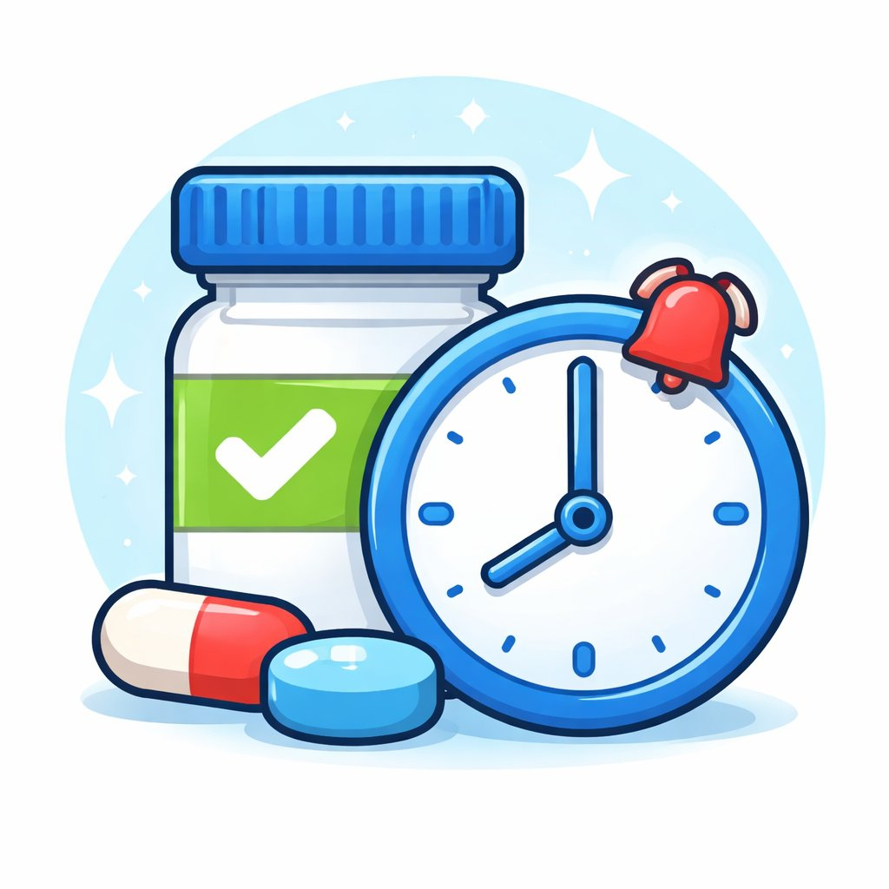
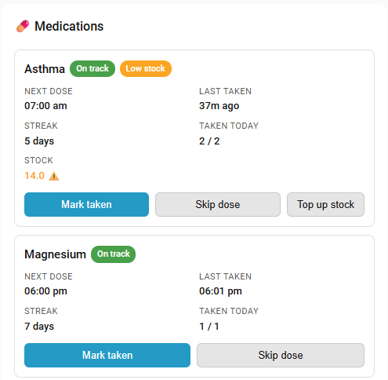

#  Medication Tracker for Home Assistant

[](https://github.com/hacs/default)
[](https://github.com/calebgab/medication_tracker/releases)
[](https://github.com/calebgab/medication_tracker/releases/latest)
[](https://github.com/calebgab/medication_tracker/releases)
[](https://github.com/calebgab/medication_tracker/actions/workflows/ci.yml)
[](https://github.com/calebgab/medication_tracker/actions/workflows/validate.yml)
[](https://github.com/calebgab/medication_tracker/actions/workflows/validate-custom.yml)
[](https://github.com/calebgab/medication_tracker/actions/workflows/hassfest.yaml)

Track medications, scheduled doses, streaks, and overdue alerts — entirely local, no cloud, no app required.

---

## Features

- **Two medication types** — scheduled (fixed times of day) and as-needed/PRN (dose-limit tracking)
- **Sensors** for next dose time, last taken timestamp, streak (consecutive days taken), and doses taken today
- **Binary sensors** for overdue detection (with configurable grace period) and due-soon alerts (within 60 minutes) for scheduled meds; availability tracking for PRN meds
- **Button entities** to mark doses as taken or skipped — appear automatically on the device page
- **Optional stock tracking** — record a current stock level per medication and it's automatically decremented each time a dose is taken, with a low-stock sensor and alert so you never run out
- **Built-in notifications** — configure due, repeating overdue reminders, due soon, taken confirmation, and low stock alerts directly from the integration, with an actionable **Mark taken** button on iOS and Android that also auto-clears any pending reminder
- **Per-medication notification overrides** — enable or disable individual alert types per medication, overriding the global settings
- **Services** to mark doses taken or skipped, reset today's log, and adjust stock (e.g. after a refill)
- **Full UI configuration** — add, edit, and remove medications via the Home Assistant UI (no YAML required)
- **Optional Lovelace card** — a custom dashboard card showing all medications with status and action buttons
- **Persistent storage** — survives restarts; today's log is pruned automatically at midnight

---

## Installation

### Via HACS (recommended)

1. Open HACS → Integrations
2. Search for **Medication Tracker** and install
3. Restart Home Assistant

### Manual

1. Copy the `custom_components/medication_tracker/` folder into your HA `custom_components/` directory
2. Restart Home Assistant

---

## Setup

1. Go to **Settings → Devices & Services → Add Integration**
2. Search for **Medication Tracker**
3. Give it a name (useful if you want multiple trackers, e.g. one per person)
4. Click **Configure** to add your first medication

---

## Configuration

### Adding a medication

Click **Configure** on the integration card, choose **Add new medication**, and fill in:

| Field | Description | Example |
|-------|-------------|---------|
| Name | Medication name | `Aspirin` |
| Dose | Optional dose description | `100mg` |
| Medication type | Scheduled or as-needed | `Scheduled` |
| Notes | Optional reminder notes | `Take with food` |

Depending on the type selected, you will then be prompted for type-specific settings (see below).

### Scheduled medications

| Field | Description | Example |
|-------|-------------|---------|
| Scheduled times | Comma-separated HH:MM (24-hour) | `08:00, 20:00` |
| Days | Days of week (leave blank = every day) | `mon, wed, fri` |

Days can be entered as `mon`, `tue`, `wed`, `thu`, `fri`, `sat`, `sun`.

### As-needed (PRN) medications

As-needed medications have no fixed schedule. Instead you configure dose limits and the integration tracks availability and usage.

| Field | Description | Example |
|-------|-------------|---------|
| Max doses per day | Calendar-day maximum | `4` |
| Max doses per 24 hours | Rolling 24-hour window maximum | `4` |
| Minimum hours between doses | Minimum gap between any two doses | `4` |

When any limit is reached the `available` binary sensor turns `off` and the `next_available` sensor shows when the medication can next be taken.

### Stock tracking (optional)

Stock tracking is off by default. To turn it on for a medication, click **Edit** on it, fill in the first screen (name/dose/type/notes) and continue — the stock fields are on the *next* screen, alongside the scheduled times/days (or as-needed dose limits):

| Field | Description | Example |
|-------|-------------|---------|
| Track stock for this medication | Enables stock tracking for this medication | *(toggle)* |
| Current stock | Starting quantity on hand | `30` |
| Units used per dose | How much to subtract from stock each time a dose is marked taken | `1` |
| Alert when stock falls to or below | Threshold at which the medication is considered low on stock | `5` |

Once enabled, stock decrements automatically every time a dose is marked taken, and the `stock` sensor / `low_stock` binary sensor start reporting real values instead of `unknown`.

**Restocking:** once tracking is on, don't re-edit the medication to change the stock count — the edit form ignores the Current stock field after the first time (to avoid a stale form value silently overwriting stock that changed while the form was open). Instead, top up stock one of these ways:

- **Device page** — open the medication's device (Settings → Devices & Services → Medication Tracker → the medication), and set the **Stock** control under Controls directly to a new value
- **Lovelace card** — click **Top up stock** on the medication's card, which opens the same Stock control
- **Service** — call `medication_tracker.adjust_stock` (see [Services](#services)) to add or subtract an amount, handy for automations (e.g. after scanning a barcode)

### Notifications

Click **Configure** on the integration card, then choose **Notifications** to set up alerts. No automations required — notifications are fired directly by the integration.

| Setting | Description |
|---------|-------------|
| Notify service | The HA notify service to use (e.g. `notify.mobile_app_your_phone`) — select from the dropdown of detected devices |
| Alert when due | Send a notification once, right at the scheduled time |
| Repeat reminder every N minutes until taken or skipped | Once a dose goes overdue, keep re-notifying every N minutes until you mark it taken or skipped |
| Overdue after / repeat every (minutes) | Single global setting used both ways: how long past the scheduled time before a dose is treated as overdue, and how often the reminder then repeats (default 30) — lower it for medications that need to be taken right on time |
| Stop repeating after this many reminders | Caps how many times it repeats before giving up (default 5) — the overdue state itself doesn't clear, it just stops notifying |
| Alert when due soon | Send a notification once, when a dose is due within 60 minutes |
| Taken confirmation | Send a notification when a dose is marked as taken |
| Alert when stock is low | Send a notification when a medication's stock falls to or below its configured threshold (applies to both scheduled and as-needed medications; requires [stock tracking](#stock-tracking-optional) to be enabled for that medication) |

Notifications on iOS and Android include a **Mark taken** action button — tapping it updates the sensors immediately without opening the app. Marking a dose taken or skipped from *anywhere* (button, dashboard, service call, or the notification action) automatically clears any pending due/overdue reminder still sitting on your phone, so you're not left with a stale "have you taken this?" notification after you've already dealt with it.

**Android note:** clearing a notification in the background is a known-unreliable operation on Android unless it's delivered with high priority — this integration always requests high-priority delivery for the clear itself, but if it's still not clearing reliably for you, check that battery optimization is disabled for the Home Assistant app (Settings → Apps → Home Assistant → Battery → Unrestricted) and consider setting that alert type's Android sound (in [Notifications](#notifications)) to **Critical**, which is the most reliable delivery path on Android.

**iOS note:** clearing a notification remotely (e.g. marking a dose taken from the dashboard on a computer, rather than tapping **Mark taken** on your phone) relies on a background push, and per [Apple's push rules as documented by the Home Assistant iOS app](https://companion.home-assistant.io/docs/notifications/notifications-basic/), iOS can delay or drop background pushes if the app hasn't been used recently — this is a platform limitation, not something a payload can override. If stale reminders aren't clearing on your iPhone, check that **Background App Refresh** is enabled for Home Assistant (Settings → General → Background App Refresh) and that Low Power Mode isn't active, and open the Home Assistant app occasionally so iOS treats it as active. Tapping the notification's own **Mark taken** action always dismisses it immediately, since that's a local, in-app interaction rather than a remote clear.

The low stock alert fires once when stock crosses the threshold and won't repeat until you restock above it (via the `adjust_stock` service) and it drops low again.

After the global settings, you can also customise the notification title and message templates for each alert type — and, alongside each template, a **Notification Sounds** section with separate iOS and Android options (they control sound differently, so each platform has its own settings). Everything defaults to **Default** — today's plain device notification tone — until you actively change it, so upgrading changes nothing until you visit this screen.

**iOS:**

| Option | Behavior |
|--------|----------|
| Default | The device's normal notification sound (unchanged from today) |
| Critical | Bypasses mute and Do Not Disturb. ⚠️ Only works if you've granted the Home Assistant app **Critical Alerts** permission in iOS Settings → Notifications → Home Assistant — a separate opt-in from normal notification permission |
| Time-sensitive | Plays a sound and is flagged "Time Sensitive" on the lock screen. You can set a custom sound name (defaults to `default`) — it must be `"default"` or the exact filename (with extension) of a sound already bundled with or imported into the Home Assistant iOS app; an unrecognized name just plays nothing, so verify it works before relying on it |
| No sound | Silences that alert type entirely on iOS |

**Android:**

| Option | Behavior |
|--------|----------|
| Default | The device's normal notification sound (unchanged from today) |
| Critical | Routes to a dedicated **Critical Medication** notification channel (with an Importance you choose: Min/Low/Default/High/Max) and requests high-priority FCM delivery, the most reliable way to get through Android's background/battery restrictions |
| No sound | Routes to a dedicated silent channel |

Android sound isn't controllable per-notification — it's tied to the notification *channel*, and Android locks a channel's sound/importance the first time it's created. If you need to change it later, do so in your phone's own notification settings (Settings → Apps → Home Assistant → Notifications → the relevant channel), not from this integration.

#### Per-medication notification overrides

After configuring global notification settings, choose **Per-medication overrides** from the Notifications menu and select a medication. You can then enable or disable each alert type individually for that medication, overriding whatever the global setting is.

**Available placeholders in message templates:**

| Placeholder | Description |
|-------------|-------------|
| `{medication}` | Medication name |
| `{dose}` | Dose description |
| `{time}` | Scheduled time |
| `{overdue_since}` | Time the dose became overdue |
| `{stock}` | Remaining stock quantity (low stock message only) |

---

## Entities

### Scheduled medications

| Entity | Description |
|--------|-------------|
| `sensor.<name>_next_dose` | Datetime of the next scheduled dose |
| `sensor.<name>_last_taken` | Datetime the medication was last marked taken |
| `sensor.<name>_streak` | Consecutive days with at least one dose taken |
| `sensor.<name>_taken_today` | Number of doses taken today |
| `binary_sensor.<name>_overdue` | `on` when a scheduled dose is past its grace period with no entry |
| `binary_sensor.<name>_due_soon` | `on` when the next dose is within 60 minutes |
| `sensor.<name>_stock` | Current stock level (`unknown` unless [stock tracking](#stock-tracking-optional) is enabled) |
| `binary_sensor.<name>_low_stock` | `on` when stock is at or below the low-stock threshold |
| `number.<name>_stock` | Editable stock control — set directly to top up or correct stock; unavailable unless stock tracking is enabled |
| `button.<name>_mark_taken` | Mark the current dose as taken |
| `button.<name>_mark_skipped` | Mark the current dose as skipped |

### As-needed (PRN) medications

| Entity | Description |
|--------|-------------|
| `sensor.<name>_next_available` | Datetime when the medication can next be taken (absent if available now) |
| `sensor.<name>_last_taken` | Datetime the medication was last marked taken |
| `sensor.<name>_streak` | Consecutive days with at least one dose taken |
| `sensor.<name>_taken_today` | Number of doses taken today |
| `binary_sensor.<name>_available` | `on` when the medication is within all dose limits and can be taken |
| `sensor.<name>_stock` | Current stock level (`unknown` unless [stock tracking](#stock-tracking-optional) is enabled) |
| `binary_sensor.<name>_low_stock` | `on` when stock is at or below the low-stock threshold |
| `number.<name>_stock` | Editable stock control — set directly to top up or correct stock; unavailable unless stock tracking is enabled |
| `button.<name>_mark_taken` | Record a dose taken now |
| `button.<name>_mark_skipped` | Mark a dose as skipped |

### State Attributes

The `next_dose` sensor includes:
- `times` — all scheduled times
- `scheduled_time` — the specific upcoming slot
- `dose` — dose description
- `notes` — any notes

The `overdue` binary sensor includes:
- `overdue_since` — ISO datetime of the missed scheduled slot

The `next_available` sensor includes:
- `as_needed_max_per_day` — configured daily maximum
- `as_needed_max_per_24h` — configured 24-hour rolling maximum
- `as_needed_min_hours` — configured minimum gap between doses

The `stock` sensor includes:
- `stock_tracking_enabled` — whether tracking is on for this medication
- `stock_per_dose` — configured units subtracted per dose
- `stock_low_threshold` — configured low-stock threshold

The `low_stock` binary sensor includes:
- `current_stock` — the current stock quantity
- `stock_low_threshold` — configured low-stock threshold

---

## Services

### `medication_tracker.mark_taken`

Record that a dose was taken.

| Parameter | Required | Description |
|-----------|----------|-------------|
| `medication_id` | ✅ | The medication's unique ID (see below) |
| `scheduled_time` | ❌ | Which scheduled slot this applies to (HH:MM) |
| `taken_at` | ❌ | When it was taken (ISO datetime, defaults to now) |

### `medication_tracker.mark_skipped`

Record that a scheduled dose was intentionally skipped (prevents overdue alert for that slot).

| Parameter | Required | Description |
|-----------|----------|-------------|
| `medication_id` | ✅ | The medication's unique ID |
| `scheduled_time` | ❌ | Which scheduled slot is being skipped |

### `medication_tracker.reset_today`

Clear all taken/skipped entries for today for a given medication.

| Parameter | Required | Description |
|-----------|----------|-------------|
| `medication_id` | ✅ | The medication's unique ID |

### `medication_tracker.adjust_stock`

Add to or subtract from a medication's current stock level — handy for automations (e.g. after scanning a barcode). For manual restocking, it's usually quicker to set the `number.<name>_stock` control directly from the device page or the **Top up stock** button on the Lovelace card (see [Stock tracking](#stock-tracking-optional)). Only works for medications with stock tracking enabled.

| Parameter | Required | Description |
|-----------|----------|-------------|
| `medication_id` | ✅ | The medication's unique ID |
| `amount` | ✅ | Quantity to add (positive) or remove (negative), e.g. `30` after a refill |

---

## Optional: Lovelace Dashboard Card

A custom card is available that shows all your medications in one place, including status, next dose time, last taken, streak, doses taken today, and Mark taken / Skip dose buttons. Medications with stock tracking enabled also show the current stock level and a **Top up stock** button.



> **Note:** This card is optional and requires a manual step, and unlike the integration itself it is **not** kept up to date by HACS — HACS only manages `custom_components/medication_tracker/`. Whenever this file changes, you need to re-copy it yourself (see below).

### Installation

1. Copy `medication-tracker-card.js` from the root of this repository into your Home Assistant `www` folder (i.e. `config/www/medication-tracker-card.js`) — via the File editor/Studio Code Server add-on, Samba, or `curl -o config/www/medication-tracker-card.js https://raw.githubusercontent.com/calebgab/medication_tracker/main/medication-tracker-card.js` from the Terminal add-on
2. Go to **Settings → Dashboards → Resources**
3. Click **Add resource**
4. Set URL to `/local/medication-tracker-card.js` and type to **JavaScript module**
5. Click **Create** then reload the page

### Updating the card

Because HACS doesn't manage this file, updating the integration via HACS does **not** update the card. After an update that touches `medication-tracker-card.js` (check the [releases](https://github.com/calebgab/medication_tracker/releases) or recent commits), repeat step 1 above to overwrite your local copy, then hard-refresh your browser (`Ctrl+Shift+R` / `Cmd+Shift+R`) — the frontend caches this file aggressively, so a HA restart alone often isn't enough.

### Adding the card to a dashboard

1. Edit any dashboard
2. Click **Add card**
3. Scroll to the bottom and select **Custom: Medication Tracker**
4. The card automatically discovers all your medications — no configuration needed

---

## Automation Examples

### Mark taken via NFC tap

```yaml
automation:
  - alias: "NFC tag - mark aspirin taken"
    trigger:
      - platform: tag
        tag_id: "your-nfc-tag-id"
    action:
      - service: medication_tracker.mark_taken
        data:
          medication_id: "your-medication-id-here"
```

### Morning briefing — show streak

```yaml
automation:
  - alias: "Morning medication briefing"
    trigger:
      - platform: time
        at: "07:50:00"
    condition:
      - condition: numeric_state
        entity_id: sensor.aspirin_streak
        above: 0
    action:
      - service: notify.mobile_app_your_phone
        data:
          title: "Good morning!"
          message: >
            Aspirin due at 08:00. Current streak:
            {{ states('sensor.aspirin_streak') }} days. Keep it up!
```

### Dashboard button to mark taken (tap-action)

```yaml
type: button
name: Mark Aspirin Taken
icon: mdi:pill
tap_action:
  action: call-service
  service: button.press
  target:
    entity_id: button.aspirin_mark_taken
```

---

## Overdue Grace Period

A scheduled dose is not considered overdue until the **Overdue after / repeat every (minutes)** setting has elapsed past its scheduled time (default 30, configurable in **Configure → Notifications**) — the same setting then controls how often it repeats once overdue. Lower it for medications that need to be taken right on time. The due-soon window is **60 minutes** before a scheduled dose.

---

## Troubleshooting

**I can't find the medication_id**
Open Developer Tools → States, find any entity for your medication (e.g. `sensor.aspirin_next_dose`), and look in the **Attributes** panel. You can also use a template:
```yaml
{{ state_attr('sensor.aspirin_next_dose', 'medication_id') }}
```

**The overdue sensor isn't triggering**
Check that your scheduled times are in `HH:MM` 24-hour format and that your HA timezone is set correctly (**Settings → System → General**).

**Entities disappeared after a restart**
This should not happen — medications are persisted in HA's `.storage` directory. If it does, check the HA logs for errors from the `medication_tracker` domain.

**Notifications aren't working**
Check that you have selected a notify target in **Configure → Notifications** and that the relevant toggles (overdue, due soon) are enabled. The notify service name must exactly match a service listed in Developer Tools → Services under `notify.`.

**The Lovelace card isn't appearing in the card picker**
Make sure the resource was added correctly (**Settings → Dashboards → Resources**) and that you did a full page reload after adding it.

---

## License

MIT
